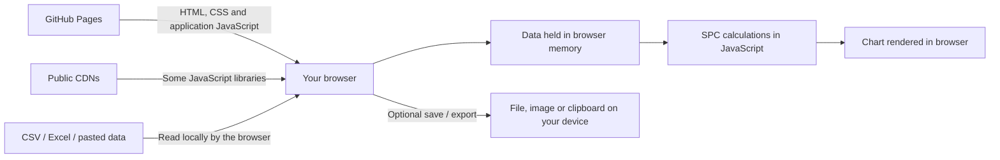

# FreeSPC – Simple SPC Web Tool

A free, open-source, browser-based Statistical Process Control (SPC) tool for quality improvement, operational monitoring and service-performance analysis.

**Use the tool:** https://freespc-nhs.github.io/spc-web-tool/

**Source code:** https://github.com/FreeSPC-nhs/spc-web-tool

FreeSPC was developed independently and is intended particularly to support NHS improvement work, although anyone may use it. It is not a formally supported NHS product or service.

> **Important:** The tool is intended for anonymous, aggregated or otherwise non-identifiable data. It is not designed for patient-identifiable information or special-category personal data.

## What the tool does

FreeSPC lets you load, enter and edit time-series data and create SPC charts directly in a web browser.

Current chart types include:

- Run charts
- XmR charts
- C charts
- P charts
- U charts
- X̄–S charts
- T charts
- G charts

Depending on the chart type, the tool also supports features such as baselines, process splits, targets, annotations, SPC signal rules, chart formatting, chart export, copying charts to the clipboard, and saving a project locally so that it can be reopened later.

The tool is intended to support quality improvement and understanding of process behaviour over time. It is not intended for:

- clinical diagnosis
- treatment decisions
- automated decisions about individuals
- patient-level risk stratification
- direct-care workflows

Users remain responsible for interpretation, governance, operational decisions and improvement actions.

---

## Privacy and data handling

### In short

The SPC calculations and processing of the data you load are performed by JavaScript running in your web browser.

FreeSPC does **not** have an application backend, application database or user-account system. The application does not intentionally send the contents of an uploaded dataset to a FreeSPC server or third-party analytics/AI service.

There are, however, some important details behind the phrase “processed in your browser”, explained below.

### How browser-only processing works

FreeSPC is a static web application hosted using GitHub Pages. When you open the site, your browser downloads the HTML, CSS and JavaScript that make up the application. Some JavaScript libraries are currently loaded from public content-delivery networks (CDNs).

After the application has loaded, data selected through the file picker or entered in the data editor are read and processed by JavaScript in the browser.

A simplified data flow is:



There is no FreeSPC application server receiving the dataset and no server-side SPC calculation service.

### What happens when I open a CSV or Excel file?

The browser gives the application access to the file that **you explicitly select**.

For Excel workbooks, the current code reads the selected file using the browser's `File.arrayBuffer()` API and parses it with the XLSX/SheetJS library in the browser. CSV files are also parsed client-side.

The resulting working data are held in JavaScript memory while you are using the page and are used to calculate and display the SPC chart.

Saved FreeSPC project files are opened using the browser `FileReader` API and are also processed locally.

### Is my dataset stored by the website?

The application does not intentionally persist the uploaded working dataset to a server, cloud database or application account.

The current application uses browser `localStorage` for a small number of interface preferences and flags, such as colour-theme and guidance/settings choices. It does **not** intentionally use `localStorage` to store the uploaded dataset itself.

Working chart data are held in browser memory for the active page/session. Refreshing or resetting the application, closing the page, or replacing the current dataset removes that in-memory working copy from the application.

### What happens when I save a project?

This is important: **a saved FreeSPC project contains the underlying project data as well as the chart settings.**

When you choose **Save chart**, the application creates a `.json` project file in the browser using a browser `Blob` and downloads it to your device. It is not intentionally uploaded to an application server as part of that process.

Once downloaded, that file is outside FreeSPC's control. It should therefore be stored, shared and deleted in accordance with your organisation's normal information-governance and security requirements.

The same general principle applies to exported chart images, PDFs, clipboard content, screenshots and presentations: once information has been copied or exported from the application, its subsequent handling is the user's responsibility.

---

## Sensitive or identifiable information

FreeSPC is intended to process data such as:

- anonymous operational data
- aggregated quality or safety measures
- non-identifiable time-series data
- counts
- rates
- percentages
- waiting-time measures
- incident counts
- other operational performance measures

The tool is **not designed for patient-identifiable information (PII) or special-category personal data**.

Browser-local processing reduces the application's exposure to uploaded data, but it does not remove the wider risks of working with sensitive information on a computer. Information could still be exposed through, for example:

- screenshots
- clipboard contents
- saved project files
- exported charts or PDFs
- shared presentations
- browser extensions
- an insecure or compromised device
- inappropriate local or shared file storage

Users should apply data minimisation and use anonymised or appropriately aggregated data wherever possible.

Organisations remain responsible for deciding whether FreeSPC is appropriate for their intended use, complying with their own information-governance and data-protection policies, and completing any local DPIA or governance review that may be required.

The public version does not technically block a user from entering identifiable information, so appropriate use relies on user and organisational governance.

---

## Third-party services and libraries

The application does not intentionally send uploaded chart data to:

- analytics platforms
- advertising services
- behavioural telemetry services
- external AI/LLM services
- a FreeSPC backend or database

The SPC Helper uses locally defined responses rather than sending questions or chart data to an external AI service.

### CDN-hosted libraries

Some JavaScript libraries are currently loaded from public CDNs when the page loads, including libraries used for charting, annotations, CSV/Excel handling and export functions.

At the time of writing, these include externally hosted copies of libraries such as:

- Chart.js
- chartjs-plugin-annotation
- PapaParse
- html2pdf.js
- jsPDF
- XLSX/SheetJS

Other application dependencies are stored within the repository.

This means that opening the application creates ordinary network requests to GitHub Pages and to the CDN providers needed to download those libraries. The application does not intentionally put the contents of the user's dataset into those library-download requests.

Because third-party JavaScript loaded from a CDN executes in the browser page, organisations with particularly strict security requirements may wish to consider this dependency as part of their local risk assessment. A possible future hardening step would be to store all runtime dependencies within the repository and use pinned/integrity-checked versions.

---

## How to verify the data flow yourself

One reason the project is open source is so that its behaviour can be inspected rather than simply taken on trust.

### Review the source

The main application files are available in this repository, including:

- `index.html` – the page structure and external/local library references
- `spc.js` – file handling, SPC calculations, chart behaviour, save/load and export logic
- `spc-helper-library.js` – the locally defined SPC Helper content
- `css/` – styling
- `js/` and `vendor/` – supporting scripts and locally stored dependencies

For example, in `spc.js` you can inspect the functions that:

- read Excel files with `file.arrayBuffer()`
- read saved project files with `FileReader`
- hold working data in the `rawRows` JavaScript variable
- create local project downloads with `Blob` and `URL.createObjectURL()`
- store interface preferences using `localStorage`

### Check network activity in your browser

You can also observe the behaviour yourself using ordinary browser developer tools:

1. Open FreeSPC.
2. Open your browser's **Developer Tools**.
3. Select the **Network** panel.
4. After the page has loaded, clear the existing network log.
5. Load a **non-sensitive test file**.
6. Generate/recalculate a chart and try the editing controls.
7. Observe whether those actions create a request that uploads the dataset to an application backend.
8. Save a project or chart and observe that the browser creates a local download.

You will normally see network requests when the page initially loads because the browser must obtain the site files and the CDN-hosted libraries described above. Those requests are different from uploading the contents of the selected dataset.

If the implementation changes in future, the source code should remain the definitive way to review what the application is doing.

---

## Technical architecture

The application is deliberately simple:

| Area | Current approach |
|---|---|
| Hosting | GitHub Pages |
| Application type | Static HTML, CSS and JavaScript |
| Application backend/API | None for SPC processing |
| Application database | None |
| Authentication/user accounts | None |
| SPC calculations | JavaScript in the browser |
| CSV/Excel parsing | JavaScript in the browser |
| Chart rendering | JavaScript in the browser |
| Project save/load | Local `.json` files selected/downloaded by the user |
| AI/LLM integration | None |
| Analytics/behavioural telemetry | None intentionally implemented |
| Runtime dependencies | Mix of repository-hosted files and public CDN-hosted libraries |

This architecture is intended to minimise the amount of operational data exposed beyond the user's browser session.

---

## Running the tool locally

Because FreeSPC is a static web application, it can also be run from a local web server for development, review or testing.

If you use Git:

```bash
git clone https://github.com/FreeSPC-nhs/spc-web-tool.git
cd spc-web-tool
python -m http.server 8000
```

Then open:

```text
http://localhost:8000
```

Alternatively, you can download the repository files and serve them using another simple local web server.

**Note:** the current version still requests some JavaScript libraries from public CDNs even when the application files themselves are being served locally.

---

## Intended use, governance and limitations

FreeSPC provides SPC visualisation and interpretation support. It does not make automated decisions about individuals.

It is not intended to substitute for professional judgement, organisational governance, or a regulated clinical/statistical system where one is required.

The tool is not currently presented as CE- or UKCA-marked medical-device software. Its intended purpose is quality improvement and SPC analysis rather than diagnosis, treatment or individual clinical decision support.

Local organisations should assess suitability for their intended use, including browser/device security, data minimisation, export handling and any governance requirements that apply locally.

---

## Open source and licence

FreeSPC is released under the **MIT License**. See [`LICENSE`](LICENSE).

The intention is to keep the tool genuinely free and reusable. Subject to the MIT licence terms, anyone may:

- use the software
- copy it
- modify it
- create their own version
- redistribute it
- include it in another project
- use it commercially or sell a modified version

You do not need to ask permission to do those things.

The MIT licence requires the copyright and licence notice to be retained in copies or substantial portions of the software. Anyone who receives the MIT-licensed FreeSPC code continues to receive the permissions granted by that licence; a third party cannot retrospectively withdraw those permissions from copies already released under MIT.

Third-party libraries included in or loaded by the project may be distributed under their own licences. The MIT licence for FreeSPC does not replace the licence terms of those third-party components.

The software is provided **“as is”**, without warranty, as set out in the licence.

---

## Development and maintenance

FreeSPC is independently developed and maintained on a **best-efforts basis**. It is not operated as a formally supported software service.

There is no fixed development roadmap, release schedule, service-level agreement or guarantee of ongoing support.

Updates may be made occasionally where feedback, an identified problem, a compatibility issue or a useful improvement makes an update worthwhile.

The public source code is available so that others can inspect it, learn from it, test it, adapt it or develop their own versions. There is no requirement to wait for the original project to be updated before doing so, provided the licence terms are followed.

---

## Feedback

Feedback and suggestions are welcome, but the repository is **not actively monitored as a support service** and a response or update cannot be guaranteed.

GitHub Issues may be used for feedback if the Issues feature is enabled for the repository, but they should not be treated as a monitored helpdesk or formal support route.

---

## Information-governance summary

The privacy-by-design approach is based on:

- browser-local processing of the working dataset
- no FreeSPC application backend or server-side dataset processing
- no FreeSPC application database or user accounts
- no intentional analytics or behavioural telemetry
- no external AI processing
- no routine server-side persistence of uploaded datasets by the application
- intended use with anonymous, aggregated or otherwise non-identifiable data

The principal residual risk is inappropriate data being entered, displayed, copied, exported, saved or shared by users, together with normal browser/device security risks, rather than server-side storage by the FreeSPC application itself.

---

## Licence

MIT License. See [`LICENSE`](LICENSE) for the full text.
